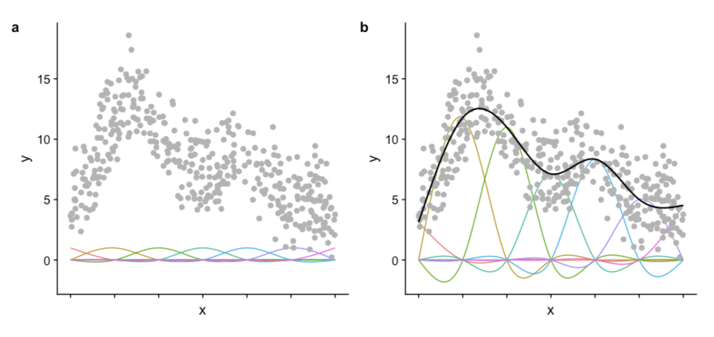
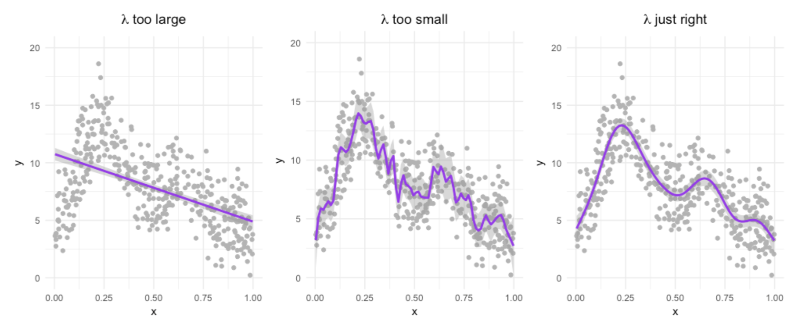
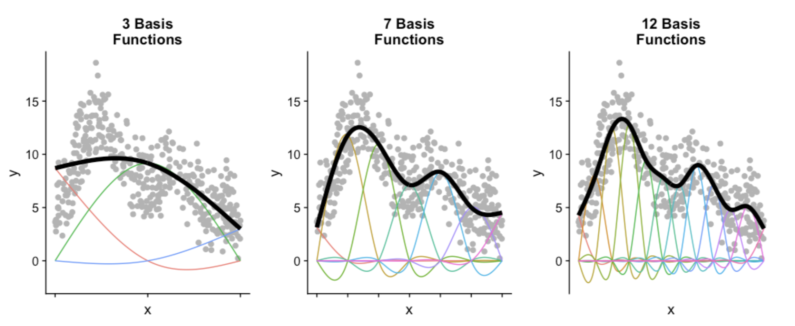

```{r setup, include=FALSE}
knitr::opts_knit$set(root.dir = '/Users/darrenwong/Documents/Projects/gam-course/rendered')
library(dplyr)
library(ggplot2)
library(MASS)
library(mgcv)
library(gamair)
library(gratia)
```

# Links

-   [Noam Ross' GAMs in R course - Chapter 1](https://noamross.github.io/gams-in-r-course/chapter1)

# Introduction

-   We often face a tension between interpretability (think simple regression - easy to understand and use for inference) and flexibility (think neural networks - can model complex relationships but aren't explainable).

    -   **Generalised Linear Models** (GAMs) provide a middle ground; they can model complex, non-linear relationships - but can still be used for inferential statistics.

# GAM Basics

-   We use **smooths/splines** in GAMs to fit data of a wide variety of shapes. To tell R we want to use a spline for a variable, we wrap it in `s()` when specifying a fitting formula.
-   The flexible splines in GAMs are actually the sum of multiple smaller functions called **basis functions**. Each basis function has a coefficient and an intercept associated it - which are parameters in the model - providing fine control over each one.
    -   This is more complex than linear models that only have one intercept and coefficient associated with each pair of dependent and independent variables
    -   We can extract coefficients from GAM fitted objects using `coef()`
    -   The figure below shows each basis function with an equal coefficient (a), and the same functions with trained coefficients (b)



# Motivation - assessing the linear approach

-   We'll first fit a linear model to the data to assess its appropriateness for this data.

```{r}
mcycle <- MASS::mcycle

# Fit LM
lm_mod <- lm(accel ~ times, data = mcycle)

mcycle %>% 
  ggplot(aes(x = times, y = accel)) +
  geom_point() +
  geom_smooth(method = 'lm')
```

-   Now we'll fit a GAM using the `mgcv` package, we can see that the fitted model is much closer to the data at more x-values.

```{r}
# Fit GAM
gam_mod <- mgcv::gam(accel ~ s(times), data = mcycle)

# Convert to a mgcViz object
draw(gam_mod, residuals = T)
```

## Anatomy of a GAM

-   As mentioned earlier, GAMs are composed of basis functions
-   We can extract the coefficients of these basis functions using the `coef()` function - we see there are 9 basis functions and one intercept term

```{r}
coef(gam_mod)
```

# Basis functions and smoothing

-   GAMs can fit highly complex relationships, but this leads to potential for overfitting the data. In this section, we'll look at how smoothing can help combat this issue.

    -   To elaborate, we want a model that fits close to the *relationship* between the variables, but not the *noise* in the data.

## [Big Wiggly Style](https://www.youtube.com/watch?v=0pdH1Ba3A7Y&themeRefresh=1) (Wiggliness)

-   How well a GAM fits the data is controlled by something called **likelihood**; how complex curves are allowed to be is controlled by **wiggliness**. Good fits (no overfitting) are achieved through a balance of the two. The relationship between the two can be shown as follows, with the $\lambda$ parameter controlling the balance (this is optimised during model fitting).

$$Fit = Likelihood - \lambda \times Wiggliness$$



<center><i>We can see above the effects of changing λ. Too large a λ we get no complexity, too small and we get clear overfitting. The optimised λ value appropriately fits the relationship in the data, and not the noise.</i></center>

-   We generally allow R to choose the optimal smoothing parameter ($\lambda$) for us, but we can set it ourselves, either for the whole model, or per smooth as follows.
-   The `mgcv` package provides for multiple methods of selecting the optimal smooth. Noam (as well as other GAM experts) recommends Restricted Maximum Likelihood (REML) as it is more likely to give you stable results. We can set this with the `method` argument.

```{r, eval = F}
# Setting the smoothing parameter
gam(y ~ s(x), data = dat, sp = 0.1)
gam(y ~ s(x, sp = 0.1), data = dat)

# Setting smoothing to restricted maximum likelihood
gam(y ~ s(x), data = dat, method = "REML")
```

## Number of basis functions

-   The other factor that can affect how wiggly a GAM is is the number of basis functions used in each smooth function.



- We can set this parameter for each smoothing function (`s()`) in the model manually with the `k` argument. If we set it too low, the model won't capture all compexity in the model - but if it's too high, the wiggliness parameter will help to dampen the overfitting. However, we need to be careful, as the more basis functions we have, the more parameters we need to estimate.

    - There is a way to test if we have the appropraite number of basis functions in each smooth which we'll discuss later in the course.
    
```{r, eval = F}
gam(y ~ s(x, k = 3), data = dat, method = "REML")
gam(y ~ s(x, k = 10), data = dat, method = "REML")
```