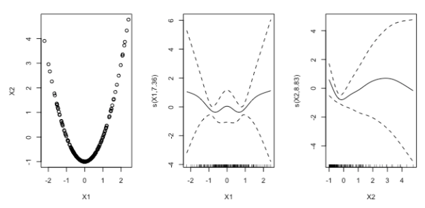

```{r setup, include=FALSE}
knitr::opts_chunk$set(fig.width = 10, fig.height = 7.5)

library(dplyr)
library(ggplot2)
library(MASS)
library(mgcv)
library(gamair)
library(gratia)
library(patchwork)
```

# Links

-   [Noam Ross' GAMs in R course - Chapter 2](https://noamross.github.io/gams-in-r-course/chapter2)

# Introduction

-   Here we learn how to dig into the model to interpret the outputs and better understand the relationship between the variables
-   As with other model types, we can run `summary()` on a GAM to view more details

```{r}
data("mpg", package = "gamair")

mod_hwy <- gam(
  hw.mpg ~ s(weight) + s(rpm) + 
  s(price) + s(comp.ratio) +
  s(width) + fuel + cylinders,
  data = mpg, method = "REML"
)

summary(mod_hwy)
```

## `summary()` part 1

-   The first part of the summary shows the model formula we fit
    -   The **family** tells us the model we fit assumes a Gaussian/normal distribution of errors
    -   The **link** being identity tells us the model doesn't transform the predictors
    -   The **formula** shows us the equation we specified

```         
Family: gaussian 
Link function: identity 

Formula:
hw.mpg ~ s(weight) + s(rpm) + s(price) + s(comp.ratio) + s(width) + 
    fuel + cylinders
```

## `summary()` part 2

-   This section shows the parametric coefficients of the linear components in the model: the coefficients, their test statistics, and their p-values.
    -   Asterisks indicate statistical significance.

```         
Parametric coefficients:
                Estimate Std. Error t value Pr(>|t|)    
(Intercept)      14.7498     4.4057   3.348 0.000993 ***
fuelgas          14.6518     4.2470   3.450 0.000699 ***
cylindersfive     0.5665     1.8291   0.310 0.757146    
cylindersfour     3.3291     1.8833   1.768 0.078817 .  
cylinderssix      1.6796     1.7900   0.938 0.349348    
cylindersthree    3.6916     4.3564   0.847 0.397902    
cylinderstwelve  -5.0484     2.9217  -1.728 0.085732 .  
cylinderstwo     -3.1243     2.2670  -1.378 0.169871    
---
Signif. codes:  0 ‘***’ 0.001 ‘**’ 0.01 ‘*’ 0.05 ‘.’ 0.1 ‘ ’ 1
```

## `summary()` part 3

-   This section shows the **estimated degrees of freedom** for each smooth term in the model.
    -   The effective degrees of freedom (`edf`) is a measure of the complexity of the smooth term.
    -   The higher the `edf`, the more complex the term. An `edf` of 1 is a straight line, while an `edf` of 2 is a quadratic curve, etc.
    -   Coefficients aren't listed since each smooth is composed of multiple parameters.

```         
Approximate significance of smooth terms:
                edf Ref.df      F p-value    
s(weight)     5.577  6.706 18.697 < 2e-16 ***
s(rpm)        2.301  2.914  5.650 0.00102 ** 
s(price)      2.006  2.582  0.715 0.50581    
s(comp.ratio) 1.000  1.000 31.207 < 2e-16 ***
s(width)      1.000  1.001  0.026 0.87290    
---
Signif. codes:  0 ‘***’ 0.001 ‘**’ 0.01 ‘*’ 0.05 ‘.’ 0.1 ‘ ’ 1
```

-   The `Ref.df` and `F` columns are test statistics used in the ANOVA test to test overall significance for the smooth.
    -   The result of the test is the p-value to the right. As before, asterisks signify statistical significance.
    -   A *significant* smooth term is one where you cannot draw a horizontal line through the 95% confidence interval of the smooth.
        -   In other words, we're testing whether the smooth is significantly different from a straight line.
        -   Insignificant smooth terms are those where we're unsure of the shape or direction of the relationship.
    -   Finally, a higher `edf` does not mean a higher likelihood of significance, and vice versa.

# Visualising GAMs

```{r}
plot(mod_hwy, pages = 1, residuals = T)
```

-   The plots generated by `mgcv`'s `plot()` method are **partial effect** plots; i.e. they show the component effects of the smooth or linear terms in the model that add up to the overall prediction. We can:
    -   choose which plots to show with the `select` argument. i.e. `plot(mod_hwy, select = c(2, 4))`
    -   choose how many pages to show the plots on with the `pages` argument
    -   ensure that linear terms are also plotted with `all.terms = T`
    -   add a *rug* along the x-axis with the `rug = T` argument
    -   add *partial residuals* to the plots with the `residuals = T` argument. These are the difference between the partial effect and the data, after all other partial effects have been accounted for.
        -   modify these points with `pch` (change shape), `cex` (change size)
    -   `se = T` adds a 95% confidence interval for the mean shape of the effect, and is on by default
        -   `shade = T` fills the confidence interval with colour, change this colour with `shade.col`
        -   This only shows the standard errors of the partial effect term. To also include the standard errors of the model intercept, use `seWithMean = T`, which gives a better idea of the total uncertainty in the model.
    -   it can also be useful for interpretation to shift the scale so the intercept is included, using `shift = coef(gam_model)[1]`
        -   the plot can now be interpreted as the prediction of the output, assuming other variables are at their mean value

# Model checking with gam.check()

-   There are several diagnostic plots we can check to make sure our fits are valid. There aer also several pitfalls to fitting GAMs we'll discuss here.

## Pitfall: Inadequate basis number

-   The number of basis functions determines how wiggly a smooth can be. A smooth with too few basis functions can be too rigid to capture the true shape of the data.
-   This is not always obvious visually (as with the below example), but we can test this via the `mgcv::gam.check()` function.

```{r, warning=FALSE}
mod_hwy_1 <- gam(hw.mpg ~ s(weight, k = 2), data = mpg, method = "REML")
plot(mod_hwy_1, pages = 1, residuals = T, se = T)
```

-   Running `gam.check()` gives us console output and several diagnostic plots. Note that our (deliberately bad) model does not pass these checks.
-   The diagnostic plots are (clockwise from top left):
    -   The **Q-Q plot** compares model residuals to a normal distribution - residuals should fall along the straight line
    -   The **histogram of residuals** should look roughly normally distributed
    -   The **residuals vs. linear predictor plot** should be evenly distributed around zero
    -   The **residuals vs. fitted values plot** should cluster around the 1-to-1 (45°) line with no systematic deviation away from it; a perfect model would show a straight line, but this is rare in practice
-   The console output contains a few checks:
    -   Firstly, it reports whether the GAM has reached convergence. If it hasn't, there likely isn't enough data for the number of parameters and the model may not be valid
    -   Secondly, we see a table of basis checking results - one for each smooth. This shows a statistical test for patterns in model residuals which should be random
        -   The table shows the `k` value (number of basis functions), the effective degrees of freedom, a test statistic, and a p-value
        -   Small p-values here indicate the residuals are not randomly distributed, often meaning there aren't enough basis functions
        -   If you fix one variable, always run `mgcv::gam.check()` again as fixing one variable may reveal an issue in another

```{r}
gam.check(mod_hwy_1)
```

## Pitfall: Concurvity

-   Even if two variables aren't collinear, they may have concurvity - i.e. one may be a smooth curve of another.
-   See the example below, X1 and X2 are not linearly related, but when plotted together form a perfect parabola. If we use them as predictors in the model we get strange confidence intervals:



- We can use `mgcv::concurvity()` on a GAM model object to measure concurvity in model variables. It has two modes:
  - `full = TRUE` reports overall concurvity for each smooth, showing how much each smooth is predetermined by all the other smooths. If the worst case value is high (say over 0.8), inspect your model more carefully.
  - If any of the values from `full = TRUE` are high, we'll also want to use the second mode setting `full = FALSE`. In this form, the function returns matrices of pairwise concurvities. We can use this to pinpoint which variables have a close relationship - again, use the worst case scenario to make your judgements. See if variables with high values have problematic shapes or confidence intervals.
  
```{r}
concurvity(mod_hwy, full = T) %>% round(2)
concurvity(mod_hwy, full = F)$worst %>% round(2)
```
  