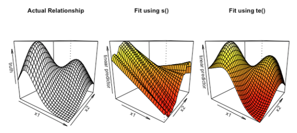

```{r setup, include=FALSE}
knitr::opts_chunk$set(fig.width = 10, fig.height = 7.5)

library(dplyr)
library(ggplot2)
library(MASS)
library(mgcv)
library(gamair)
library(gratia)
library(patchwork)
```

# Links

-   [Noam Ross' GAMs in R course - Chapter 3](https://noamross.github.io/gams-in-r-course/chapter3)

# Introduction

-   Here we learn how to extend GAMs to fit models with interactions, and how to use these interactions to fit and visualise spatial models.

# Two-dimensional smooths and spatial data

-   We can extend the GAM framework to include smooths of multiple variables (so far we've only been using smooths of single variables).
-   Interactions in models represent the fact that outcomes depend on non-independent relationships of multiple variables. In a GAM, this can be seen as the relationship between the two variables and the outcome changing across the range of the smooth.
    -   Note this is also a natural way to represent spatial data.


-   The syntax for interactions in GAMs is simple, we just put the two variables inside the `s()` function: `s(x1, x2)`.
    -   We can mix interactions with other linear and non-linear terms (`y ~ s(x1, x2) + s(x3) + x4`)
    -   A common way to model geospatial data is to use an interaction term of x and y co-ordinates, along with individual terms for other predictors.
-   For exercises involving interactions in GAMs, we'll use a new data set from `sp` called `meuse` - a geospatial dataset of heavy metal soil pollution in the Meuse river in the Netherlands.

```{r}
data(meuse, package = 'sp')
glimpse(meuse)
```

## summary() outputs

-   You'll see the interaction term as a single smooth term when viewing the outputs of `summary()`. This combines the effect of `x`, `y`, and their interaction into a single smooth (we'll discuss how to separate these later in the chapter).
-   Note the high EDF for this term, it takes many more basis functions (and therefore more data) to build a two-dimensional surface rather than a one-dimensional line.
    -   We can see how many basis functions are used for each interaction by looking at `coef(model)`

```{r}
cad_gam <- mgcv::gam(
  cadmium ~ s(x, y) + s(elev) + s(dist),
  data = meuse, method = 'REML'
)

summary(cad_gam)
```

# Plotting and interpreting GAM interactions

-   Interactions are powerful tools for modelling complex or spatial data, however their complexity makes it more challenging for us to understand them. Visualisation is a great tool for doing this.

-   We can use `mgcv`'s `plot()` function to visualise the interaction term as a contour plot. The axes represent the values of our predictor variables.

    -   The interior is a topographic map of predicted values - the contour lines represent (labelled) points of equal predicted values.
    -   The dotted lines show uncertainty in prediction, and represent how much the contour lines would move if the predictions were one standard error higher or lower.

-   A contour plot is not always the most intuitive way of plotting interactions, so we can also plot it in the 3D space with `plot(., scheme = 1)`.

-   Setting `scheme = 2` generates a heat map, which is a simplified contour map upon which colours are added. Red represents smaller predictions, yellow represents higher ones.

```{r}
plot(cad_gam, pages = 1)

# We can plot the 2D contour map using `gratia` with:
# gratia::draw(cad_gam, residuals = T, select = 1, ...)

plot(cad_gam, scheme = 1, select = 1)
plot(cad_gam, scheme = 2, select = 1)


```

## Using vis.gam()

-   The predefined schemes are useful for viewing model interactions quickly, but `mgcv::vis.gam()` provides many more options. We'll focus on the more important ones:
    -   `view` allows you to list which variables you want to visualise jointly
    -   `plot.type = 'persp'` produces a 3D perspective plot; the variables chosen don't need to be in an interaction term to see their combined effects
        -   `se` displays confidence intervals of the predictions on perspective plots. It takes the number of standard errors away from the average preditions to plot the high- and low-prediction surfaces.
        -   Control the rotation angle of your perspective plots with `theta` (horizontal), `phi` (vertical), and `r` (zoom). An `r` value too low will have distortion or parallax, however too high and we have little sense of perspective.
    -   `plot.type = 'contour'` produces a contour/heatmap plot
        -   `too.far` shows you which combinations of data should not be plotted as they are too far from the actual data (i.e. how far is too far to extrapolate?) This lets you see which combinations of variables are not well represented in your data and therefore might not yield good predictions.
            -   This is scaled from 0 to 1; if we set it at 0.05 then we will see the combinations that are greater than 5% distance from actual data as blank on the graph.
        -   `color`, `contour.col`, and `nlevels` lets you choose the background colour palette, the colour of the contour lines, and the number of contour lines (important for showing details and interactions) respectively.

```{r}
vis.gam(
  cad_gam, view = c('x', 'y'),
  plot.type = 'persp', se = 2,
  theta = 30, phi = 30, r = 1.5
)

vis.gam(
  cad_gam, view = c('x', 'y'),
  plot.type = 'contour', too.far = 0.05
)

```

# Visualising categorical-continuous interactions

-   Simple smooth x, y interactions are not the only kind of complex relationship we can model. Here we look at how we can create interactions between categorical and continuous terms.
-   Back in Chapter 1, we introduced the idea of categorical-continuous interactions (`s(weight, by = fuel)`), i.e. fitting a different smooth for each value of a categorical value.
-   There's another kind of categorical-continuous interaction called a 'factor-smooth'. Rather than using the `by` argument, we use a `factor-smooth` basis type to `'fs'`. We do not need to include an additional linear term to make separate intercepts for each level in this case as this is accounted for by `bs = 'fs'`.
    -   We use these when controlling for effects of categories that are not our main variables of interest (and when there are very many categories or only a few data points in some categories)
    -   We do not get a different term for each level of the categorical variable, but rather one overall interaction term. This means they are not as good for distinguishing between categories.
-   Calling the `plot()` function on a GAM with a factor-smooth fit will by default make one plot with multiple smooths on it. A more useful method is to use `vis.gam()` to visualise the factor-smooths, which will give you a staircase-like shape.

```{r}
cop_gam <- gam(
  copper ~ s(dist, landuse, bs = 'fs'),
  data = meuse, method = 'REML'
)

vis.gam(cop_gam, view = c('dist', 'landuse'), plot.type = 'persp')
```

# Interactions with different scales

-   Here is another kind of smooth we'll learn about - the tensor smooth. Tensor smooths allow us to model interactions that operate on different scales, such as space and time.
-   Earlier in this chapter, we discussed 2D interaction smooths of the form `s(x, y)`. These have a single smoothing parameter/lambda value.
-   However, there are situations where having a single smoothing parameter does not make sense. For example, in our meuse dataset we have `x`, `y`, and elevation all in meters. We'd expect the scale of change to be similar across x and y, but it could be different on a per-meter basis with elevation where small changes could mean very different environments.
    -   In other words, these terms would likely not have the same wiggliness.
-   Similarly, it wouldn't make sense to use the same wiggliness to model distance and the `om` variable which measures organic matter in grams per kilogram - a completely different unit of measurement.
-   To handle these situations, we have tensor smooths. Similar to a regular 2D smooth, but it has two smoothing parameters - one for each variable. We can use these by using `te()` instead of `s()`. We can also specify a different number of basis functions for each smooth.
-   See below an example of why tensors can be much better tools in some cases. Here, `x1` and `x2` are on very different scales. A model fit using `s()` - assuming both variables vary similarly - doesn't give us as good a fit as using `te()`.

<center>



</center>

-   Another advantage of using tensors is they can be used to separate out interactions from individual univariate effects. Using tensors, we can model only the interaction between two variables and not their independent effects which we can model separately.
    -   To do this, we use `s()` to model each individual variable, then tensor interactions - `ti()` - to model each interaction. Note though that each component has its own smoothing parameters and basis functions, meaning again we need more data.

<center>


</center>

-   Viewing the summary, we can see the separate smooth terms for each variable and their interaction term, allowing us to assess their effects individually.

<center>


</center>

-   Finally, plotting the model shows the univariate smooths and the interaction term - all additive effects. Separating the effects this way can make complex models more understandable.

<center>


</center>


```{r}
cad_gam_1 <- gam(
    cadmium ~ s(x, y) + s(elev) + ti(x, y, elev),
    data = meuse, method = 'REML'
)

summary(cad_gam_1)
plot(cad_gam_1, pages = 1)
```