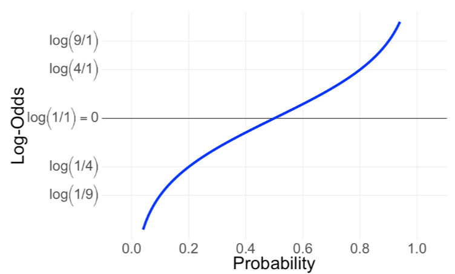
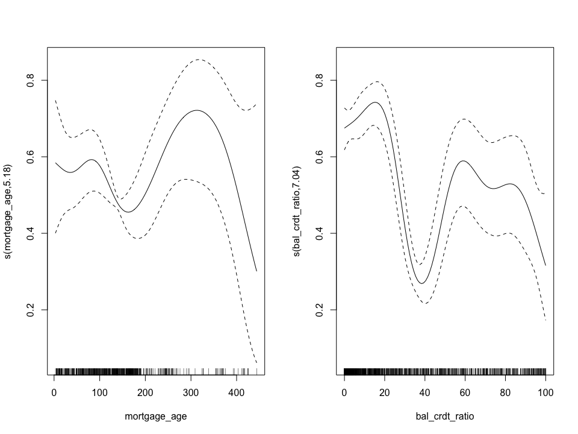
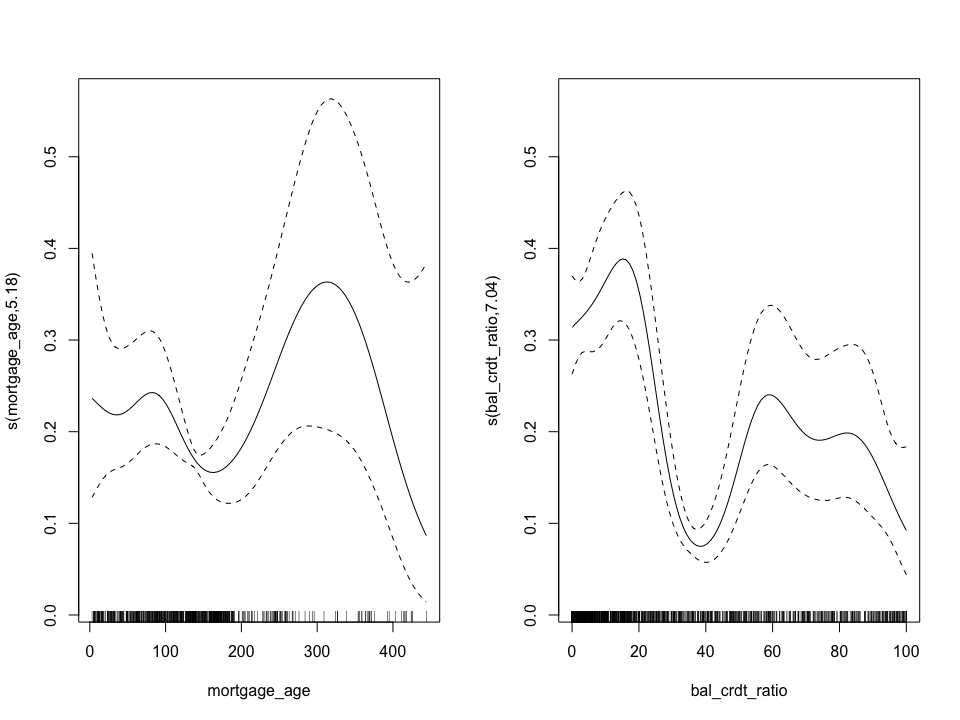
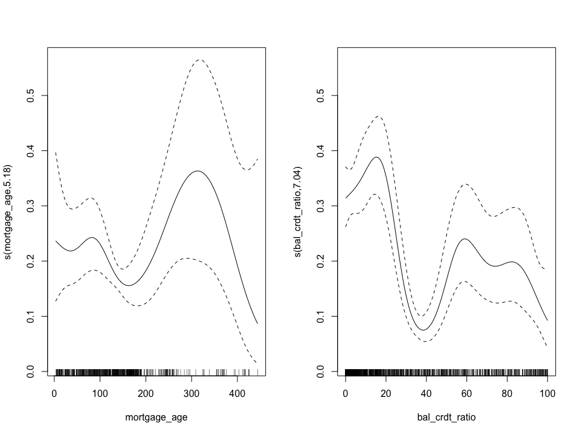
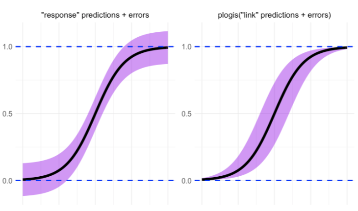

04 Logistic GAMs for Classification
================
2024-11-17

- [Links](#links)
- [Introduction](#introduction)
- [Types of model outcomes](#types-of-model-outcomes)
- [Visualising logistic GAMs](#visualising-logistic-gams)
- [Making predictions](#making-predictions)
- [Doing more with GAMs](#doing-more-with-gams)
  - [Wrap-up](#wrap-up)
  - [Other 📦s](#other-s)
  - [Help files](#help-files)

# Links

- [Noam Ross’ GAMs in R course - Chapter
  4](https://noamross.github.io/gams-in-r-course/chapter4)

# Introduction

- Here we extend GAMs from modelling continuous outcomes to modelling
  binary ones.

# Types of model outcomes

- Our previous data had response values that could take on many
  different numeric values such as speed, fuel efficiency, etc. However,
  we often want to model data with binary outcomes like the presence of
  organisms, customer conversion, etc.
- When we model a binary outcome, our prediction is a probability
  between 0 and 1. Since GAMs have an outcome of any number, we convert
  the GAM output to a probability using a logistic link function.
  - The logistic function is a transformation that converts numbers of
    any value (in this case, the log of the ratio of positive to
    negative outcomes) to probabilities between 0 and 1.

<center>


</center>

- The inverse of the logistic function is the logit function, which
  translates probabilities between zero and one to log-odds which can
  have any value.

<center>



</center>

``` r
# Logistic function is plogis, the logit function is qlogis
qlogis(plogis(0.5))
```

    ## [1] 0.5

``` r
# Also; see how probabilities convert to odds. A probability of 25% converts to the log odds of 1 positive to 3 negatives
qlogis(0.25) == log(1/3)
```

    ## [1] TRUE

- To use the logistic and logit functions to fit a GAM, we need to set
  the `family = binomial` argument in our GAM function call. This tells
  the GAM function that outcomes are ones and zeros, and that it should
  fit the model on a logistic scale.

- The output of a logistic GAM looks similar to that of previous GAMs we
  fit. However, the link function has changed to `logit` and it’s
  important to understand the outputs are on the log-odds scale. To
  interpret them as probabilities we’ll need to convert them using the
  logistic function (`plogis()`).

<center>


</center>

- We’ll be using the `csale` dataset consisting of anonymised
  information from the insurance industry. The outcome `purchase`
  represents whether a customer purchased insurance following a direct
  mail campaign. The other variables consist of information from the
  credit reports of those customers.

``` r
csale <- url('https://github.com/noamross/gams-in-r-course/raw/refs/heads/master/csale.rds') %>%
  readRDS()
glimpse(csale)
```

    ## Rows: 1,779
    ## Columns: 8
    ## $ purchase          <dbl> 0, 0, 0, 0, 0, 0, 0, 0, 1, 0, 0, 0, 0, 0, 1, 0, 0, 0…
    ## $ n_acts            <dbl> 11, 0, 6, 8, 8, 1, 5, 0, 9, 18, 0, 0, 0, 6, 2, 13, 3…
    ## $ bal_crdt_ratio    <dbl> 0.00000, 36.09506, 17.60000, 12.50000, 59.10000, 90.…
    ## $ avg_prem_balance  <dbl> 2494.414, 2494.414, 2494.414, 2494.414, 2494.414, 24…
    ## $ retail_crdt_ratio <dbl> 0.00000, 11.49123, 0.00000, 0.80000, 20.80000, 11.49…
    ## $ avg_fin_balance   <dbl> 1767.197, 1767.197, 0.000, 1021.000, 797.000, 4953.0…
    ## $ mortgage_age      <dbl> 182.0000, 138.9601, 138.9601, 138.9601, 93.0000, 138…
    ## $ cred_limit        <dbl> 12500, 0, 0, 0, 0, 0, 0, 0, 11500, 16000, 0, 0, 0, 1…

``` r
sal_mod <- gam(
  purchase ~ s(mortgage_age) + s(bal_crdt_ratio),
  data = csale, family = binomial
)

# As before, the estimated probability of a person making a purchase who has mean values of all variables is the intercept (but with `plogis()` applied to get to probability):
plogis(coef(sal_mod)[[1]])
```

    ## [1] 0.1805556

# Visualising logistic GAMs

- Here we’ll learn how to modify plotting commands to make our logistic
  visualisations more easy to understand.
- When we plot the output of a logistic GAM, we see the partial effect
  of smooths on a log-odds scale; which makes it difficult to interpret
  them.
- We can convert our output to the probability scale by setting
  `trans = plogis`.

``` r
plot(sal_mod, pages = 1, trans = plogis)
```

<!-- -->

- However, by default all partial effects are centered on an average
  value of 0.5, this is because we’re looking at each partial effect
  with no intercept. To incorporate the intercept, we can use the shift
  argument - adding the value of the intercept to each graph.
  - Each partial effect plot can now be interpreted as showing the
    probability of the outcome if all other variables are at their
    average value. At each variable’s average value, you get only the
    effect of the intercept.

``` r
plot(sal_mod, pages = 1, trans = plogis, shift = coef(sal_mod)[1])
```

<!-- -->

- Earlier we learnt about the `seWithMean` argument which adds intercept
  uncertainty to the smooth uncertainty. Now the confidence intervals
  also have a natural interpretation - they are the range of uncertainty
  of the probability of the outcome for any value of the variable,
  holding other variables equal at their average value.

``` r
plot(sal_mod, pages = 1, trans = plogis, shift = coef(sal_mod)[1], seWithMean = T)
```

<!-- -->

# Making predictions

- We can use `predict()` directly on the model object to get predictions
  over the data points used to fit the model.
- By default predictions are returned on the ‘link’ scale - i.e. the
  scale on which the model was fit to the data. For logistic models,
  that is the log-odds scale so we’ll need to set `type = 'response'` to
  get predictions on the probability scale. Note this is equivalent to
  running `plogis()` over the predictions.

``` r
preds <- predict(sal_mod, type = 'response', se.fit = TRUE)

invisible( # Didn't want to load purrr just for this...
  preds %>% lapply(function(x) print(x[1:5]))
)
```

    ##          1          2          3          4          5 
    ## 0.28825802 0.07301849 0.36149135 0.36100445 0.31009003 
    ##           1           2           3           4           5 
    ## 0.042679688 0.009967908 0.039129074 0.034650466 0.059853780

- If we wanted to get standard errors for our predictions, set
  `se.fit = T`. However, these are only an approximation on the
  probability scale. If you use standard errors to construct confidence
  intervals for the predictions, do so on the log-odds scale, then
  convert to probability using `plogis()`.
  - Otherwise you’ll get confidence intervals breaching 0 and 1.

<center>



</center>

- Of course we’re also interested in model predictions beyond the data
  we used to fit the model. Pass a data-frame to `newdata` for this

``` r
predict(sal_mod, type = 'response', newdata = test_df)
```

- Finally, it is useful to understand how each term contributes to an
  individual prediction. We can do this by setting `type = 'terms'`. If
  we were to sum across all columns and add the intercept, we’d have our
  overall prediction on the log-odds scale.

``` r
predict(sal_mod, type = 'terms') %>% as_tibble() %>% 
  mutate(intercept = coef(sal_mod)[[1]], .before = 1) %>% 
  head()
```

    ## # A tibble: 6 × 3
    ##   intercept `s(mortgage_age)` `s(bal_crdt_ratio)`
    ##       <dbl>             <dbl>               <dbl>
    ## 1     -1.51           -0.122               0.731 
    ## 2     -1.51           -0.0822             -0.946 
    ## 3     -1.51           -0.0822              1.03  
    ## 4     -1.51           -0.0822              1.02  
    ## 5     -1.51            0.351               0.362 
    ## 6     -1.51           -0.0822             -0.0669

# Doing more with GAMs

## Wrap-up

- We’ve learnt the following things in this course
  - Chapter 1: GAM theory, fitting GAMs, and mixing linear and
    non-linear terms
  - Chapter 2: Interpreting and visualising GAMs, as well as model
    diagnostics and concurvity
  - Chapter 3: 2D interactions and spatial data, interactions with
    different scales, continuous-categorical interactions
  - Chapter 4: Logistic GAMs, plotting logistic outputs, making
    predictions

## Other 📦s

- GAMS also work readily with `tidyverse` tools such as the `broom` 📦’s
  `augment()`, `tidy()`, and `glance()`.
- You can also use the `caret` 📦 - passing `'gam'` to the `method`
  argument to fit models with the `mgcv` 📦.

## Help files

- Use `?smooth.terms` to view the other types of smooths available in
  the `mgcv` 📦. these can be useful in specific situations such as
  geospatial modelling or seasonal time series.
- Use `?family.mgcv` to view the other types of outcomes - such as count
  data - which you can model with GAMs.
- `mgcv` also has tools for variable selection when model building, use
  `?gam.selection` to learn about these.
- `?gam.models` will show you alternative or more complex model
  structures such as mixed effects.
