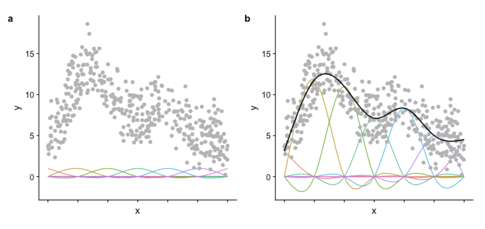
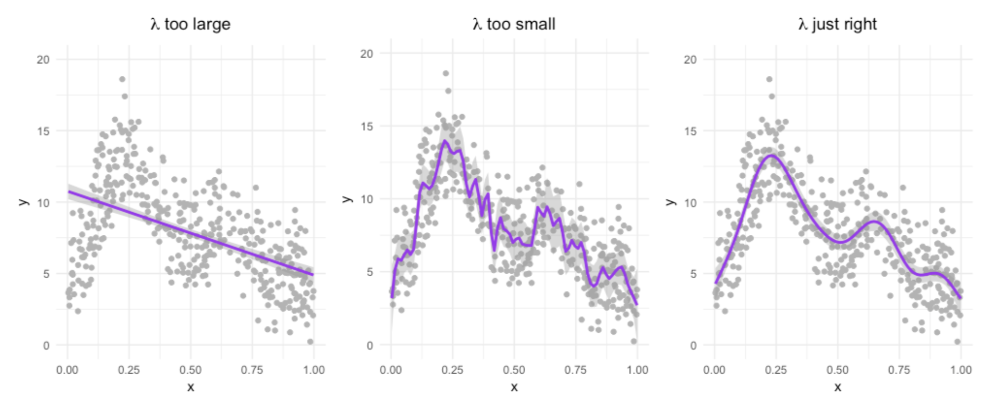
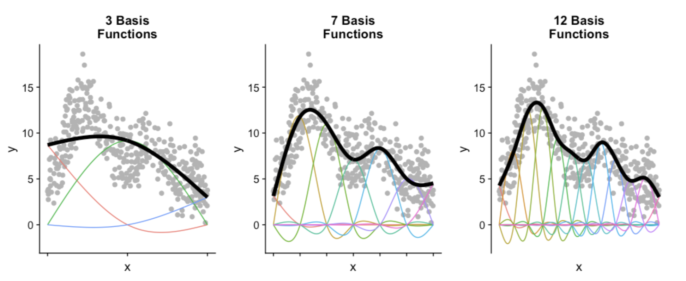
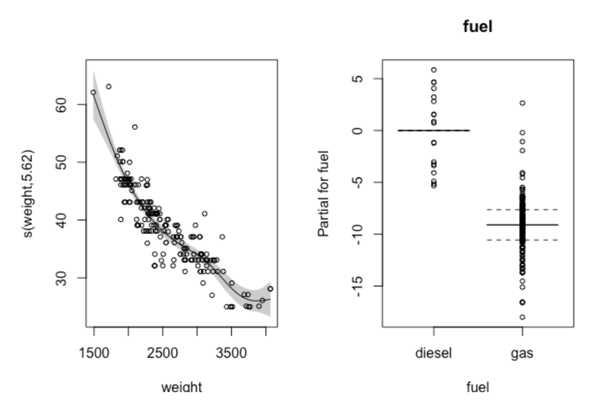

01 Introduction to GAMs
================
Darren Wong
2024-07-20

- [Links](#links)
- [Introduction](#introduction)
- [GAM Basics](#gam-basics)
- [Motivation - assessing the linear
  approach](#motivation---assessing-the-linear-approach)
  - [Anatomy of a GAM](#anatomy-of-a-gam)
- [Basis functions and smoothing](#basis-functions-and-smoothing)
  - [Big Wiggly Style (Wiggliness)](#big-wiggly-style-wiggliness)
  - [Number of basis functions](#number-of-basis-functions)
  - [Example - setting complexity with the motorcycle
    model](#example---setting-complexity-with-the-motorcycle-model)
- [Multivariate GAMs](#multivariate-gams)
  - [Continuous variables](#continuous-variables)
  - [Categorical variables](#categorical-variables)
  - [Example - `mpg` data](#example---mpg-data)

# Links

- [Noam Ross’ GAMs in R course - Chapter
  1](https://noamross.github.io/gams-in-r-course/chapter1)

# Introduction

- We often face a tension between interpretability (think simple
  regression - easy to understand and use for inference) and flexibility
  (think neural networks - can model complex relationships but aren’t
  explainable).

  - **Generalised Linear Models** (GAMs) provide a middle ground; they
    can model complex, non-linear relationships - but can still be used
    for inferential statistics.

# GAM Basics

- We use **smooths/splines** in GAMs to fit data of a wide variety of
  shapes. To tell R we want to use a spline for a variable, we wrap it
  in `s()` when specifying a fitting formula.
- The flexible splines in GAMs are actually the sum of multiple smaller
  functions called **basis functions**. Each basis function has a
  coefficient and an intercept associated it - which are parameters in
  the model - providing fine control over each one.
  - This is more complex than linear models that only have one intercept
    and coefficient associated with each pair of dependent and
    independent variables
  - We can extract coefficients from GAM fitted objects using `coef()`
  - The figure below shows each basis function with an equal coefficient
    (a), and the same functions with trained coefficients (b)



# Motivation - assessing the linear approach

- We’ll first fit a linear model to the data to assess its
  appropriateness for this data.

``` r
mcycle <- MASS::mcycle

# Fit LM
lm_mod <- lm(accel ~ times, data = mcycle)

mcycle %>% 
  ggplot(aes(x = times, y = accel)) +
  geom_point() +
  geom_smooth(method = 'lm')
```

    ## `geom_smooth()` using formula = 'y ~ x'

<!-- -->

- Now we’ll fit a GAM using the `mgcv` package, we can see that the
  fitted model is much closer to the data at more x-values.

``` r
# Fit GAM
gam_mod <- mgcv::gam(accel ~ s(times), data = mcycle)

# Convert to a mgcViz object
draw(gam_mod, residuals = T)
```

<!-- -->

## Anatomy of a GAM

- As mentioned earlier, GAMs are composed of basis functions
- We can extract the coefficients of these basis functions using the
  `coef()` function - we see there are 9 basis functions and one
  intercept term

``` r
coef(gam_mod)
```

    ## (Intercept)  s(times).1  s(times).2  s(times).3  s(times).4  s(times).5 
    ##  -25.545865  -63.718008   43.475644 -110.350132  -22.181006   35.034423 
    ##  s(times).6  s(times).7  s(times).8  s(times).9 
    ##   93.176458   -9.283018 -111.661472   17.603782

# Basis functions and smoothing

- GAMs can fit highly complex relationships, but this leads to potential
  for overfitting the data. In this section, we’ll look at how smoothing
  can help combat this issue.

  - To elaborate, we want a model that fits close to the *relationship*
    between the variables, but not the *noise* in the data.

## [Big Wiggly Style](https://www.youtube.com/watch?v=0pdH1Ba3A7Y&themeRefresh=1) (Wiggliness)

- How well a GAM fits the data is controlled by something called
  **likelihood**; how complex curves are allowed to be is controlled by
  **wiggliness**. Good fits (no overfitting) are achieved through a
  balance of the two. The relationship between the two can be shown as
  follows, with the $\lambda$ parameter controlling the balance (this is
  optimised during model fitting).

$$Fit = Likelihood - \lambda \times Wiggliness$$



<center>
<i>We can see above the effects of changing λ. Too large a λ we get no
complexity, too small and we get clear overfitting. The optimised λ
value appropriately fits the relationship in the data, and not the
noise.</i>
</center>

- We generally allow R to choose the optimal smoothing parameter
  ($\lambda$) for us, but we can set it ourselves, either for the whole
  model, or per smooth as follows.
- The `mgcv` package provides for multiple methods of selecting the
  optimal smooth. Noam (as well as other GAM experts) recommends
  Restricted Maximum Likelihood (REML) as it is more likely to give you
  stable results. We can set this with the `method` argument.

``` r
# Setting the smoothing parameter
gam(y ~ s(x), data = dat, sp = 0.1)
gam(y ~ s(x, sp = 0.1), data = dat)

# Setting smoothing to restricted maximum likelihood
gam(y ~ s(x), data = dat, method = "REML")
```

## Number of basis functions

- The other factor that can affect how wiggly a GAM is is the number of
  basis functions used in each smooth function.



- We can set this parameter for each smoothing function (`s()`) in the
  model manually with the `k` argument. If we set it too low, the model
  won’t capture all compexity in the model - but if it’s too high, the
  wiggliness parameter will help to dampen the overfitting. However, we
  need to be careful, as the more basis functions we have, the more
  parameters we need to estimate.

  - There is a way to test if we have the appropraite number of basis
    functions in each smooth which we’ll discuss later in the course.

``` r
gam(y ~ s(x, k = 3), data = dat, method = "REML")
gam(y ~ s(x, k = 10), data = dat, method = "REML")
```

## Example - setting complexity with the motorcycle model

- Here we’ll manually set the smoothing parameter that controls
  wiggliness

``` r
# Fix the smoothing parameter at 0
gam_mod_s0 <- gam(accel ~ s(times), data = mcycle, sp = 0)

# Fix the smoothing parameter at 0.0001
gam_mod_s1 <- gam(accel ~ s(times), data = mcycle, sp = 0.0001)

# Fix the smoothing parameter at 0.1
gam_mod_s2 <- gam(accel ~ s(times), data = mcycle, sp = 0.1)


# Visualize the GAMs
(
  draw(gam_mod_s0, residuals = T) +
    labs(title = 'lambda = 0', x = 'Times')
) + 
(
  draw(gam_mod_s1, residuals = T) +
    labs(title = 'lambda = 0.0001', x = 'Times')
) + 
( 
  draw(gam_mod_s2, residuals = T) +
    labs(title = 'lambda = 0.1', x = 'Times')
) + 
  plot_layout(nrow = 3)
```

<!-- -->

- Manually setting the number of basis functions in each smooth

``` r
# Fit a GAM with 3 basis functions
gam_mod_k3 <- gam(accel ~ s(times, k = 3), data = mcycle)

# Fit with 20 basis functions
gam_mod_k20 <- gam(accel ~ s(times, k = 20), data = mcycle)

# Fit with 50 basis functions
gam_mod_k50 <- gam(accel ~ s(times, k = 50), data = mcycle, sp = 0.0001, method = 'REML')

# Visualize the GAMs
(
  draw(gam_mod_k3, residuals = T) +
    labs(title = '3 basis funcs', x = 'Times')
) + 
( 
  draw(gam_mod_k20, residuals = T) +
    labs(title = '20 basis funcs', x = 'Times')
) + 
( 
  draw(gam_mod_k50, residuals = T) +
    labs(title = '50 basis funcs, sp = 0.0001', x = 'Times', subtitle = 'Recipe for overfitting')
) + 
  plot_layout(nrow = 3)
```

<!-- -->

# Multivariate GAMs

- We can also fit GAMs with multiple predictors; including smooths,
  linear effects, and continuous or categorical variables.

## Continuous variables

``` r
data("mpg", package = "gamair")

mpg_mod <- gam(
  hw.mpg ~ s(weight) + s(length), 
  data   = mpg,
  method = "REML"
)

draw(mpg_mod, residuals = T)
```

<!-- -->

- Both the effects of weight and price on `hw.mpg` are non-linear, and
  they are added together to get the final prediction (where the
  *additive* in Generalised Additive Model comes from).

  - `length` has a generally increasing relationship with `hw.mpg`, but
    is generally weaker than the effect of `weight`.

- We can also set the relationship to strictly linear, however we don’t
  often do this in practice since if the relationship were truly linear,
  the automatic smoothing would force a linear shape.

  - We can also set `sp = 1000` in `s(length)` to force a linear
    relationship.

## Categorical variables

- We can also model categorical variables, and this is where linear
  terms are more useful to us. When we include a categorical variable,
  the model fits a fixed effect for each value of the variable.

  - The categorical variable *must* be stored as a factor
  - Note the non-linear effect of `weight` applies to both fuel types;
    this is similar to a fixed-slope, varying intercept model

``` r
gam(hw.mpg ~ s(weight) + fuel, data = mpg, method = "REML")
```



- If we wanted, we could vary the effect of weight *by* different fuel
  types as well; however if we do this, we generally also want to retain
  the by-variable as a fixed effect. This is in case the different
  categories are different in overall mean, as well as their non-linear
  relationship on the dependent variable.

``` r
mpg_mod_byfuel <- gam(
    hw.mpg ~ s(weight, by = fuel) + fuel, 
    data   = mpg,
    method = "REML"
)

draw(mpg_mod_byfuel, residuals = T) +
  draw(mpg_mod_byfuel %>% parametric_effects()) +
  plot_layout(ncol = 3)
```

<!-- -->

## Example - `mpg` data

- Adding smooths for each of `weight`, `length`, `price`

``` r
mpg_mod <- gam(city.mpg ~ s(weight) + s(length) + s(price), data = mpg, method = "REML")

draw(mpg_mod, residuals = T) + plot_layout(ncol = 3, nrow = 1)
```

<!-- -->

- Adding categorical fixed effects for `fuel`, `drive`, and `style`

``` r
mpg_mod2 <- gam(city.mpg ~ s(weight) + s(length) + s(price) + fuel + drive + style, data = mpg, method = "REML")

# This works, but if we wanted to use the base `mgcv::plot.gam()` method...
(draw(mpg_mod2, residuals = T) + plot_layout(ncol = 3, nrow = 1)) / 
  (draw(mpg_mod2 %>% parametric_effects()) + plot_layout(ncol = 3, nrow = 1))
```

<!-- -->

``` r
# # ...then we'd do this
# draw(mpg_mod2, residuals = T) +
#   ~plot(mpg_mod2, select = 4, all.terms = T) +
#   ~plot(mpg_mod2, select = 5, all.terms = T) +
#   ~plot(mpg_mod2, select = 6, all.terms = T) +
#   plot_layout(nrow = 2)
```

- Adding smooths for `weight`, `length`, and `price`, but splitting each
  by `drive`

``` r
mpg_mod3 <- gam(city.mpg ~ s(weight, by = drive) + s(length, by = drive) + s(price, by = drive) + drive, data = mpg, method = "REML")

# Plotting smooth terms
draw(mpg_mod3, residuals = T) & scale_x_continuous(labels = scales::comma)
```

<!-- -->

``` r
# Plotting fixed/parametric effect
draw(mpg_mod3 %>% parametric_effects())
```

<!-- -->
